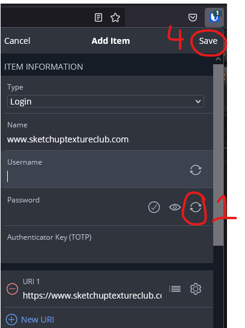

# Dev Ops

## Bitwarden Setup

1. go to [Bitwarden](https://bitwarden.com/) and sign up for an account. **Master Password Note:** Use a *very* strong master password (>12 characters, upper/lower, special character, number, letters) and make it so you can easily remember it. <u>Example</u>: John Doe likes Beethoven --> J0hn*D03&B33!h0v3n
2. Install the Browser extension to either Firefox, Chrome or Brave browsers. **Chrome/ Brave Note:** on chrome or brave you must select the 'puzzle' icon in top right and then 'pin' the Bitwarden extension after it is installed.

3. Login in to Bitwarden

4. After logging in go to settings and for convenience sake set (iii) Vault timeout = never (iv) = vault timeout action ,(v) unlock with pin (vi) when setting pin *uncheck* lock with master passwork

   

5. usage. when using, sometimes it is easier to **pop out** the extension (arrow icon on upper right) to allow for persistence while making additions. modifications. To add entries you can either press (**+**) icon or you can press the 'save' button that appears naturally when adding credentials to website (be sure NOT to use the browsers own save)

   

6. Types of Entries:

   a. Secure note: Consider using notes which are not associated with specific websites, the 'custom fields' can also be used:

   

   b. **Existing Login:** a standard login can be auto-entered if it is stored in your bitwarden account and you just click on the icon when you get to the login screen. Note that the login must be associated with the URL. if the beginning of the URL does not match the 'Website' field then will not auto-associate and you will have to search for it.

   
   
   c. **New Login:** when making new logins, open up the manager and (1) generate a password (2.) configure strong password settings, (3) select password (4) save the entry (5) then click on Bitwarden icon to enter the password into the registration form field.
   
   
   
   