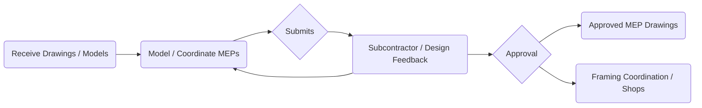
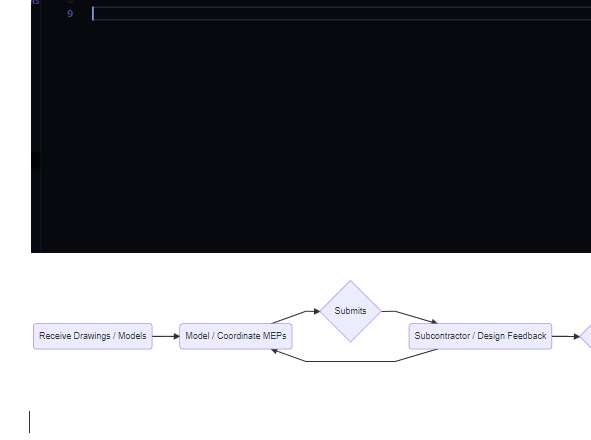

**NOTES**:  you cannot name the picture with parenthesis in the name.

# temp picture

# picture in assets
Entire Path

Relative Path

# picture on github

```mermaid
graph LR;
    A(Receive Drawings / Models)-->B(Model / Coordinate MEPs);
    B-->C{Submits};
    C-->D(Subcontractor / Design Feedback);
    D-->B;
    D-->E{Approval}
    E-->F(Approved MEP Drawings)
    E-->G(Framing Coordination / Shops)
```

